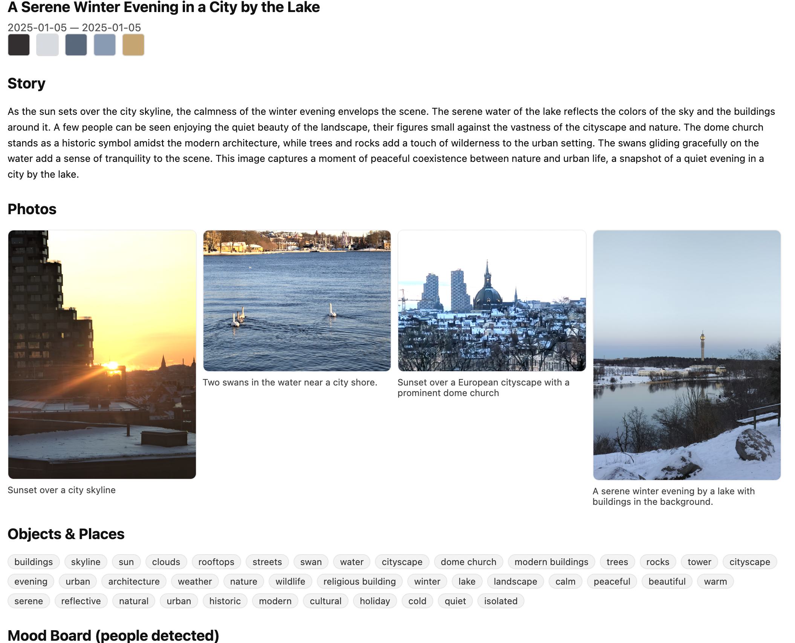

# Piary: diary from pictures

## Pipeline

- indexes photos (EXIF time/GPS)
- clusters events (time + distance heuristic)
- uses a single VLM (via Ollama) to emit strict per-photo JSON
- aggregates an event story with the same VLM
- extracts dominant color palettes
- renders HTML storybooks per event

## Quick start

1) Environment setup

   ```bash
   uv sync
   ```

2) Install Ollama and pull a vision model (choose one):

   ```bash
   brew install ollama || curl -fsSL https://ollama.com/install.sh | sh
   ollama serve &
   ollama pull llava:13b
   ```

3) Run on a folder of photos

   ```bash
   python -m ananda.run \
     --photo-dir "/path/to/photos" \
     --model llava:13b \
     --out-dir ./out
   ```

## Notes

- Everything runs locally; per-photo outputs are cached under `out/.cache/photo_json`.
- Adjust thresholds with `--time-gap-hours`, `--distance-gap-km`, `--min-event-size` as needed.

## Example

One cluster with 4 photos from >1k photos is in album/ and the output html is found in out/

